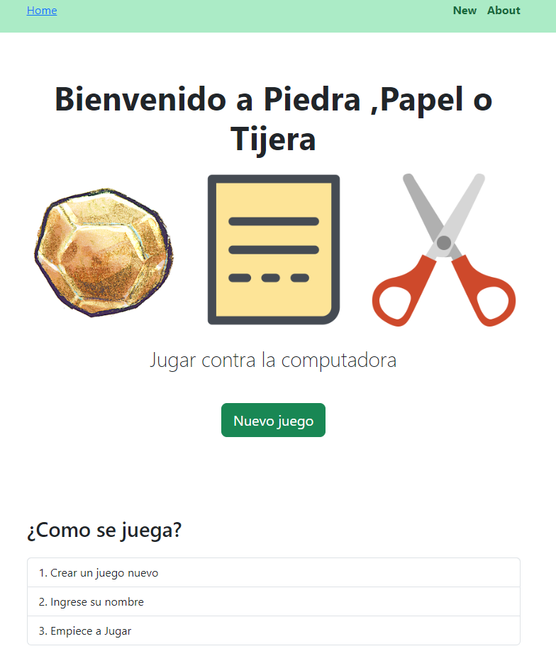
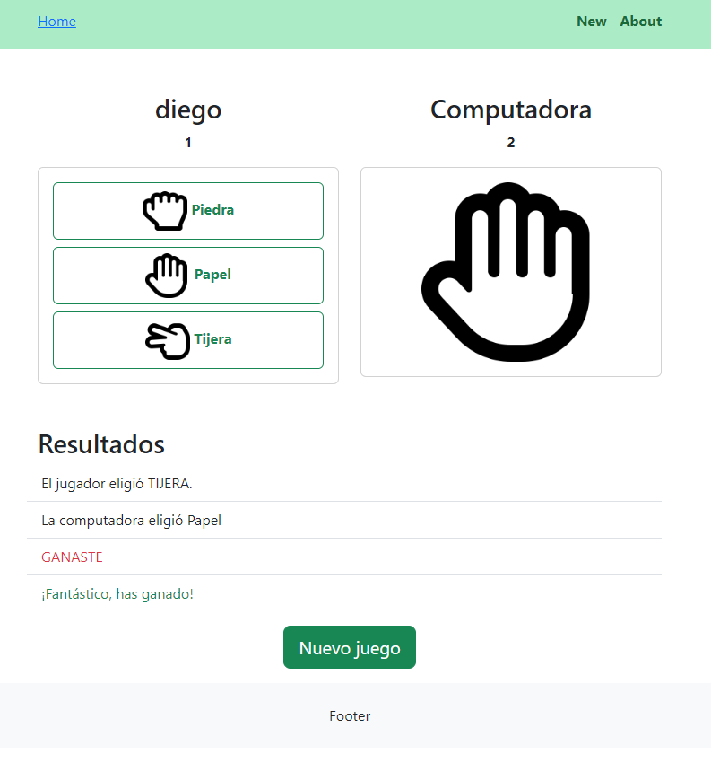

# WEB  PAPER , ROCK AND SCISSORS


Nota: Usar google chrome para que funcione el cambio de imagenes 

<p align="center">
  
</p>

<p align="center">
  
</p>

Modo debug para no detener y volver a iniciar el servidor se usa Air ,
comando:

```python
go install github.com/cosmtrek/air@latest

air -v  #para comprobar version

air init #para crear el archivo de configuracion de reinicio auto

air #para ejecutar aplicacion , ya no es necesario el go run 
```